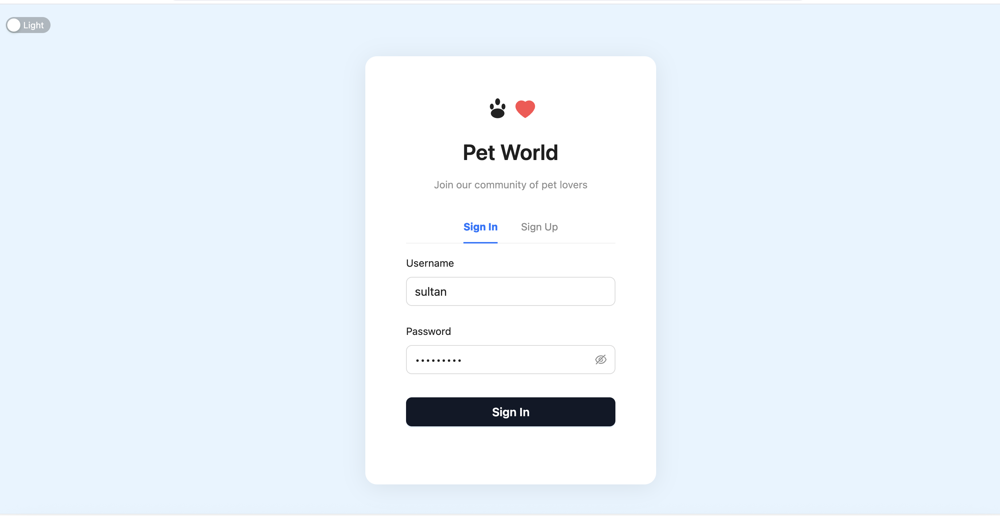
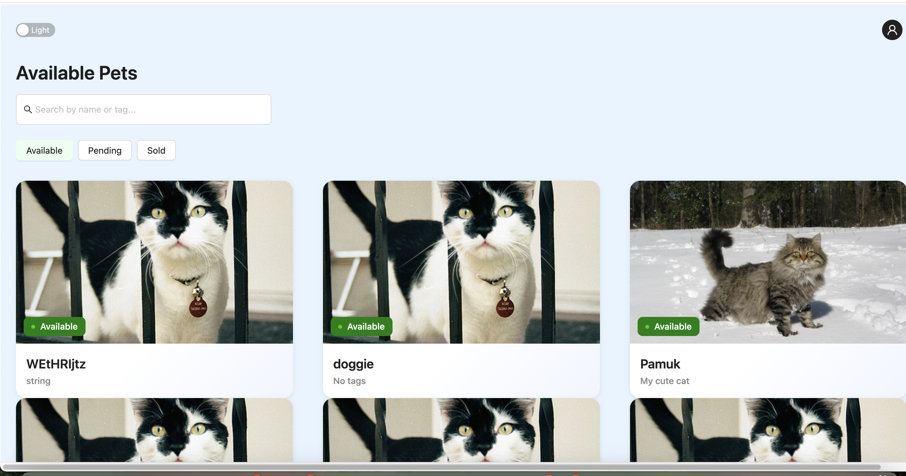
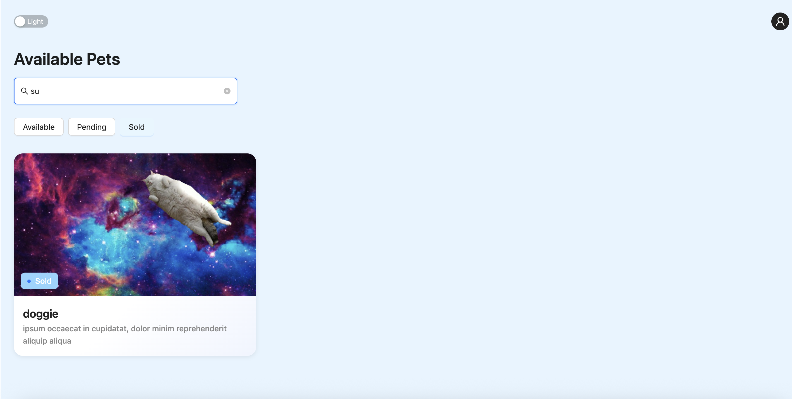
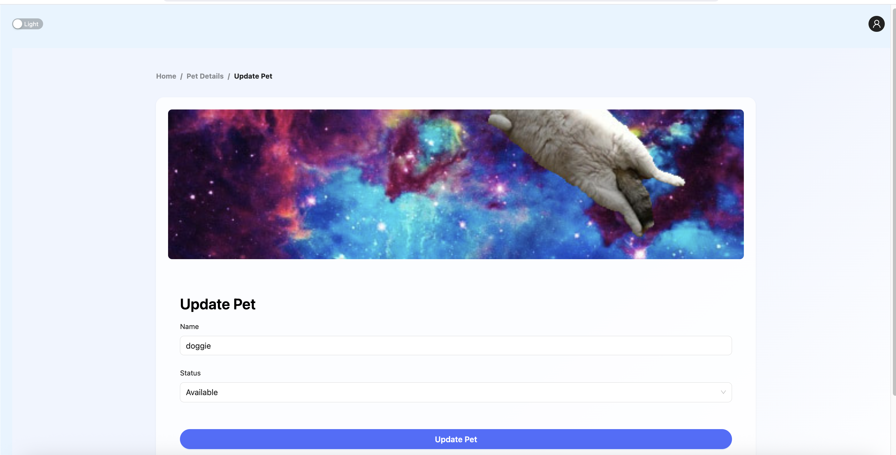
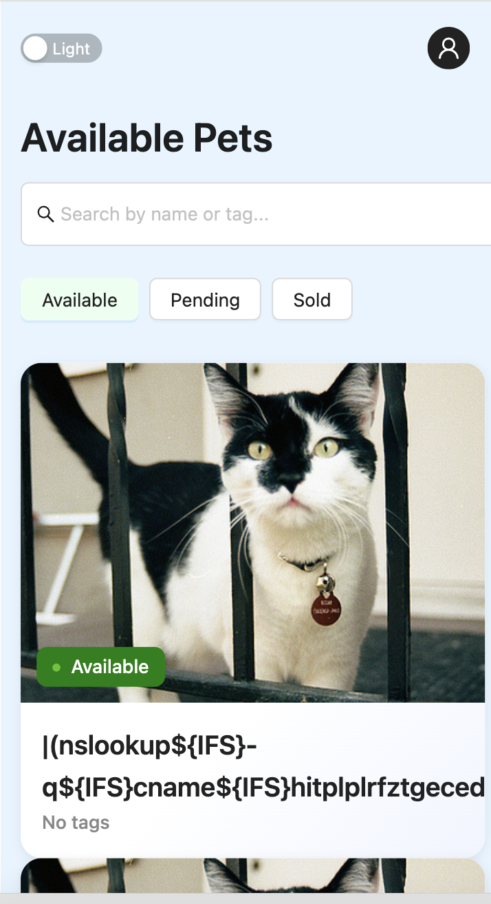
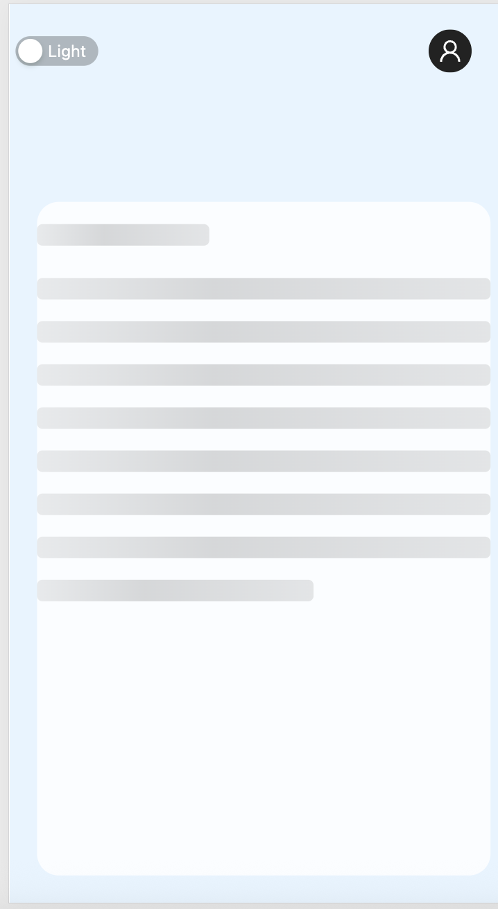
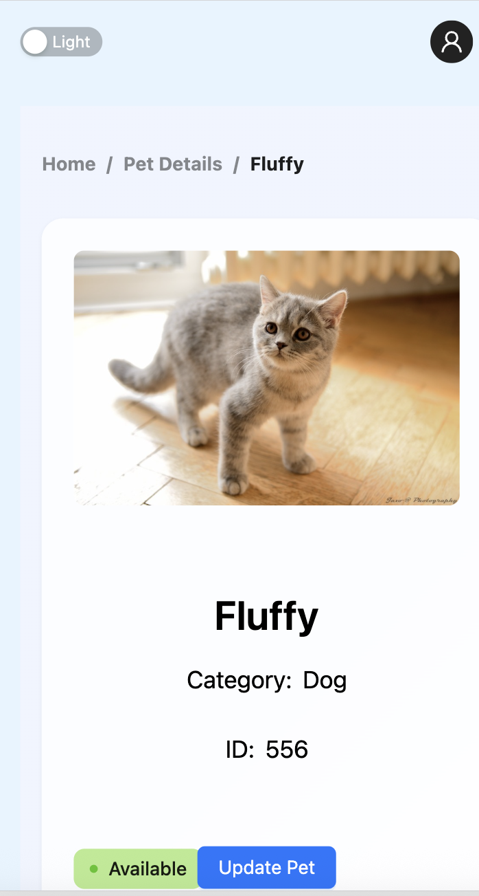
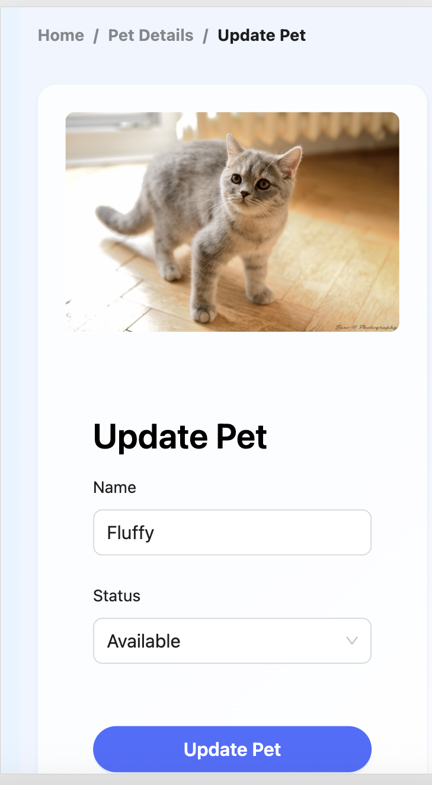

# Pet Store

A modern React + TypeScript web application for managing and viewing pets, styled with Ant Design and powered by Vite.

## Screenshots

























## Folder Structure

```
petstore/
├── public/                # Static assets (favicon, etc.)
├── src/                   # Main source code
│   ├── App.css            # Global styles
│   ├── App.tsx            # Main app component
│   ├── assets/            # Static assets (e.g., images)
│   ├── components/        # UI components
│   │   ├── atoms/         # Small, reusable UI elements (e.g., Header, PetCard)
│   │   ├── Molecules/     # Composed UI elements (e.g., RenderPet)
│   │   ├── organisms/     # Complex UI blocks (e.g., LoginForm, RegisterForm)
│   │   ├── pages/         # Page-level components (e.g., Home, Login, PetDetails)
│   ├── Hoc/               # Higher-order components (e.g., withAuth, WithCardComponent)
│   ├── hooks/             # Custom React hooks (e.g., useSearchPet)
│   ├── icon/              # Custom icon components
│   ├── main.tsx           # App entry point
│   ├── service/           # Data fetching and business logic (e.g., useAuth, usePet)
│   ├── store/             # Zustand stores for state management
│   ├── vite-env.d.ts      # Vite environment types
├── index.html             # Main HTML file
├── package.json           # Project metadata and scripts
├── tsconfig*.json         # TypeScript configuration
├── vite.config.ts         # Vite configuration
```

## Key Packages Used

- **react, react-dom**: Core React libraries for building UI.
- **react-router-dom**: Routing for single-page applications.
- **antd**: Ant Design, a popular React UI framework.
- **@tanstack/react-query**: Data fetching, caching, and synchronization.
- **zustand**: Simple, fast state management for React.
- **react-hook-form**: Form state management and validation.
- **yup**: Schema validation for forms.
- **vite**: Fast build tool and development server.
- **typescript**: Type safety and modern JavaScript features.

## Development

- **Start dev server:** `npm run dev`
- **Build for production:** `npm run build`
- **Lint code:** `npm run lint`

## Notes
- All styles are managed in `src/App.css` using global class names.
- The app is structured using atomic design principles (atoms, molecules, organisms, pages).
- Data fetching is handled via custom hooks in `src/service/` and `src/hooks/`.
- **Dark/Light Mode:** The app supports both dark and light themes, which can be toggled by the user.
- **Responsive Design:** The app is fully responsive and works well on both small (mobile) and large (desktop) devices.

---

Feel free to explore the codebase and customize it for your needs!
